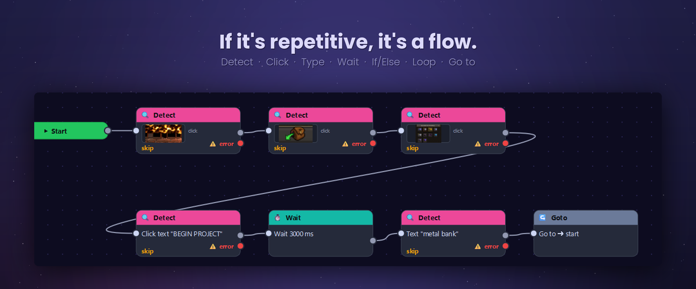
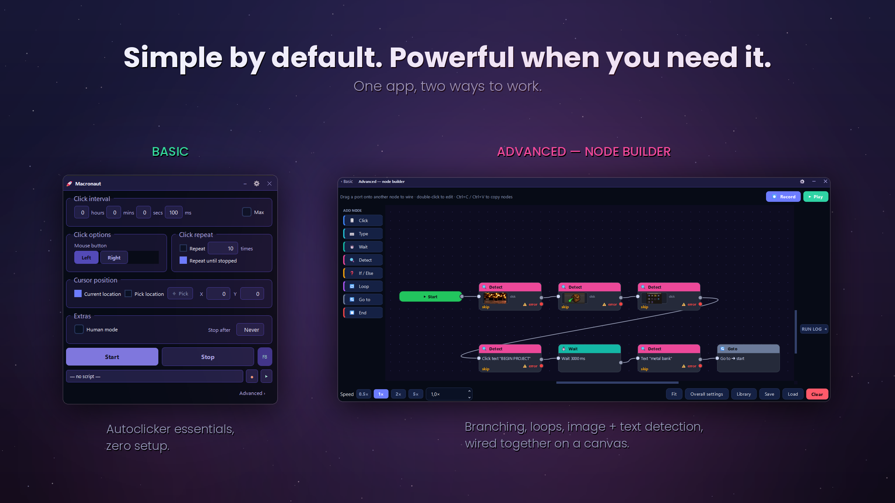
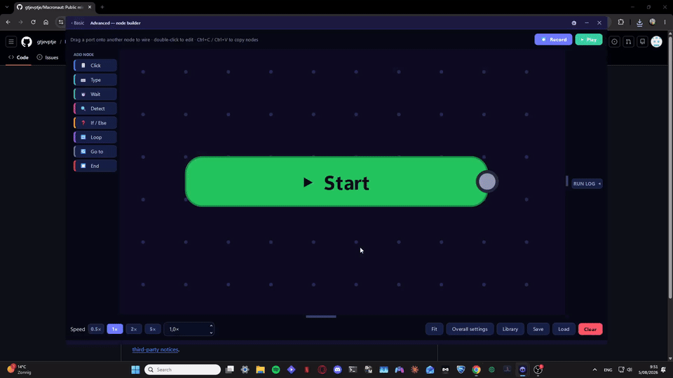

<p align="center">
  
</p>

<h1 align="center">Macronaut</h1>

<p align="center"><b>The AutoHotkey alternative without the code.</b><br>
Automate repetitive tasks in any Windows app — draw the flow, press play.</p>

<p align="center">
  <a href="https://github.com/gtjevptje/macronaut-releases/releases/latest"></a>
  <a href="https://github.com/gtjevptje/macronaut-releases/releases/latest"></a>
  <a href="https://github.com/gtjevptje/macronaut-releases/releases"></a>
  
</p>

<h3 align="center">
  <a href="https://github.com/gtjevptje/macronaut-releases/releases/latest/download/Macronaut.exe">⬇&nbsp;&nbsp;Download Macronaut for Windows</a>
</h3>

<p align="center"><i>One file. No installer. It updates itself.</i></p>

---

## Two ways to work

<p align="center">
  
</p>

**Basic** is a click macro with everything on one screen — interval, button, repeat,
cursor position, a global panic hotkey. Open it, press Start.

**Advanced** is a node canvas. Drag out Click, Type, Wait, Detect, If/Else, Loop and
Go&nbsp;to nodes, wire them together, and press Play. Anything you can describe as a
sequence of steps, you can build without writing a line of code.

## What it does

- **Sees the screen.** Detect nodes match an image or read text (OCR), so a flow can
  wait for a button to appear instead of guessing at a delay.
- **Branches and loops.** If/Else on a detection result, loop while or until a
  condition holds, jump anywhere with Go&nbsp;to.
- **Records what you do.** Hit Record, perform the task once, get a flow you can edit.
- **Handles failure.** Every detection has an error path — skip the step, retry, or
  branch somewhere else.
- **Reaches apps that ignore normal input.** Selectable input backends: standard,
  SendInput scancodes, or a kernel-level driver for software that only accepts raw
  input.
- **Saves and reloads flows** from a built-in script library.

<p align="center">
  
</p>

## Requirements

Windows 10 or 11, 64-bit. Nothing else — the download is self-contained.

## First run

Macronaut isn't code-signed yet, so Windows SmartScreen shows **"Windows protected
your PC"** the first time you open it. Click **More info → Run anyway**.

If you'd rather verify the file first, every release publishes its exact size and
SHA-256 in
[`update.json`](https://github.com/gtjevptje/macronaut-releases/releases/latest/download/update.json):

```powershell
Get-FileHash .\Macronaut.exe -Algorithm SHA256
```

## Updates

Macronaut checks this repository for new releases and can update itself — it
downloads the new build, verifies its hash, and swaps itself on the next restart.
You can also just download the latest .exe again over the old one.

[**All releases and what changed in each →**](https://github.com/gtjevptje/macronaut-releases/releases)

---

<sub>This repository hosts published builds and update manifests only; Macronaut's
source is not public. See the
[licence](https://github.com/gtjevptje/macronaut-releases/releases/latest/download/LICENSE)
and the
[third-party notices](https://github.com/gtjevptje/macronaut-releases/releases/latest/download/THIRD-PARTY-NOTICES.md).
© Gerben van Poucke.</sub>
