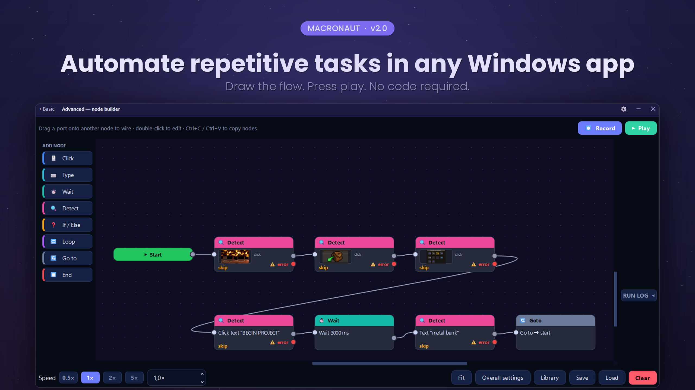
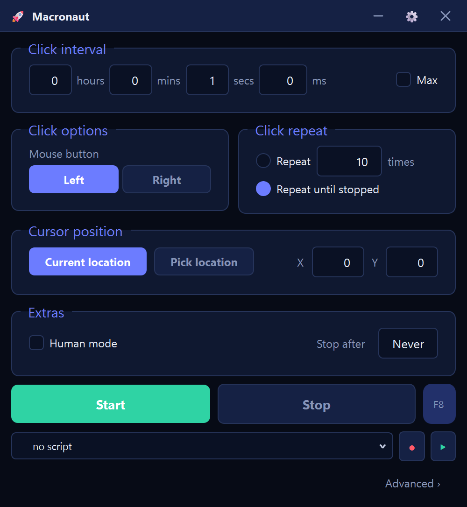

<h1 align="center">Macronaut</h1>

<b>The AutoHotkey alternative without the code.</b> 
Automate repetitive tasks in any Windows app — draw the flow, press play.

  
  
  
  

<h3 align="center">
  <a href="https://github.com/gtjevptje/Macronaut/releases/latest/download/Macronaut.exe">⬇&nbsp;&nbsp;Download Macronaut for Windows</a>
   Windows shows <b>“Windows protected your PC”</b> on first run —
  click <b>More info → Run anyway</b>. It does that for any unsigned app.
</h3>

<i>One file. No installer. It updates itself.</i>

<a href="https://gtjevptje.github.io/Macronaut/"><b>macronaut website →</b></a>

---

## What it is

Macronaut automates clicking, typing and waiting in **any** Windows program —
including ones with no API, no scripting support and no plugins.

It has **two faces, and you pick which one you get.**

**Basic** is a plain auto-clicker. Click interval, which button, how many times,
where — set the numbers, press Start. It is the layout anyone who has used an
auto-clicker already knows, and nothing about it involves a node, a flow or a
diagram. If that is all you came for, you are done on this screen.

**Advanced** is the node canvas, one click away: boxes for the things it does,
wires for the order they happen in. Record yourself once and it lands there as
editable steps, or draw it yourself. No scripting language to learn.

Macronaut opens on whichever one you closed it on, and each remembers its own
size and position — Basic parked in a corner beside the window it is clicking,
Advanced as big as you like.

If you have ever thought *"I do this exact sequence twenty times a day"*, that
is the thing Macronaut is for.

Coming from another tool? There are honest comparisons — each one saying what
the other still does better, because there is always something:
[**vs AutoHotkey**](https://gtjevptje.github.io/Macronaut/autohotkey-alternative.html) if you have been
meaning to learn it for a year, and
[**vs TinyTask**](https://gtjevptje.github.io/Macronaut/tinytask-alternative.html) if you have re-recorded
the same macro three times because a window moved.

Just want the clicker? [**The auto clicker page**](https://gtjevptje.github.io/Macronaut/auto-clicker.html)
covers setting one up, choosing an interval, and the two things nobody explains:
why antivirus complains about every tool in this category, and how you stop the
thing once it is running. There is also a
[**click speed test**](https://gtjevptje.github.io/Macronaut/click-speed-test.html) — no ads, no sign-up,
runs in the page.

It arrives with **5 automations already built** — an auto-clicker, a
clicker that stops after a set number of clicks, one that clicks once every 30
seconds to keep a session awake, one that types a block of text, and one that
presses a key over and over. None of them need setting up: open one from the
library and press Play.

## Free or Pro

**The free tier is a complete auto-clicker, not a trial.** No timer, no
watermark, no expiry, no account, no nagging. **The whole Basic face is free
and always will be** — that is the tier's reason to exist, not a sample of it.
Clicking, typing, dragging, scrolling and recording are free permanently too,
in flows of up to 20 steps.

**Pro** — €9.99, once — adds the half that makes it an automation tool
rather than a clicker: the steps that **look at the screen** and the steps that
**decide what to do about it**.

| | Free | Pro |
|---|:---:|:---:|
| **Basic — the plain auto-clicker** | ✅ | ✅ |
| Click, move, drag, scroll | ✅ | ✅ |
| Type text, press keys and chords | ✅ | ✅ |
| Record what you do into an editable flow | ✅ | ✅ |
| Waits, delays, loop counts, playback speed | ✅ | ✅ |
| Global hotkey and per-script launcher keys | ✅ | ✅ |
| All three input backends | ✅ | ✅ |
| Steps per flow | 20 | unlimited |
| Wait for an image, then click it | — | ✅ |
| Wait for text (Windows OCR) | — | ✅ |
| Wait for a pixel to change | — | ✅ |
| If / Else, Loop, variables, Go to | — | ✅ |

One payment. Yours forever, on every computer you own. Not a subscription, and every future update is included.
[See the pricing page →](https://gtjevptje.github.io/Macronaut/#buy)

A flow that uses Pro steps still opens, edits and saves on the free tier — it
just will not *run* until it is licensed. You never lose work.

## What it can do

**Just click something, over and over** *(the Basic face)*
- Interval in hours / minutes / seconds / milliseconds, or **Max** for as fast
  as the machine will go
- Left or right button, at the cursor or at a fixed X·Y you can pick off screen
- Repeat a set number of times, until you stop it, or until a stop-after timer
  runs out
- Human mode jitters the cursor so the movement is not machine-perfect
- Start and Stop, plus the same global hotkey the rest of the app uses

**Build a flow visually** *(the Advanced face)*
- Drop in **Click**, **Move**, **Drag**, **Scroll**, **Type text**, **Key press**,
  **Wait**, **Comment** — and, with Pro, **Detect**, **If / Else**, **Loop** and **Go to**
- Wire them together and press ▶ — the running step lights up as it goes
- Group a region with a **comment box**; drag the box and everything on it moves
- Colour-code nodes, bend wires around each other, jump between sections
- Copy, paste, duplicate and bulk-edit across the whole flow or just a selection

**React to what's on screen** *(Pro)*
- **Find an image** — wait for a button, a dialog or an icon to appear, then click it
- **Read text** — wait until specific words show up, using Windows' built-in OCR
- **Check a pixel** — the cheapest possible "is the panel open yet?"
- Every detection has a **✓ true** and a **✗ false** branch, so a flow can handle
  the case where the thing never appears

**Record instead of build**
- Hit ⏺ and work normally — clicks, keystrokes, chords, scroll flicks and
  click-and-drag gestures all land on the canvas as editable nodes
- Held keys stay held; a swipe is recorded as a swipe, not as a click

**Hold keys down**
- Press and release are separate actions, so a flow can hold **W** to keep moving
  while it clicks with the mouse
- Anything still held is always released when the run ends, stops or crashes

**Run it your way**
- Global start/stop hotkey that works while another window is focused
- Bind **different scripts to different keys** — one keypress launches one flow
- Playback speed multiplier, loop counts, per-step delays
- Timing estimates and a run timeline, measured on your machine rather than guessed

**Reach programs that ignore normal input**
- Three selectable input backends: standard, **SendInput scancodes**, and the
  **Interception** kernel driver
- Some programs — games especially — discard ordinary injected input. The lower
  backends look like a real keyboard to them.

**Stays out of the way**
- Single 78 MB `.exe`, no installer, no Python, no admin needed to run
- Checks for updates and applies them on restart, verified by SHA-256
- Always-on-top mode, system tray icon, dark and light themes

## Privacy

Macronaut has no accounts and no telemetry. Automations run entirely on your
machine, and a Pro licence is verified **offline** — activating tells us
nothing, because there is nothing for it to tell. The one thing that ever leaves
your computer is a crash report, and only if you opt in; those carry the error,
the version, your Windows version and which step was running, never your
scripts, your keystrokes, anything on screen, or your name.

## Requirements

Windows 10 or 11, 64-bit. Nothing else — everything is inside the `.exe`.

> **On first run, Windows may warn you.** Macronaut is not code-signed yet, so
> SmartScreen shows *"Windows protected your PC"* for new downloads. Click
> **More info → Run anyway**. Signing is on the roadmap.

## A word of warning

Macronaut sends real keyboard and mouse input. **Many online games and services
forbid automation in their terms of service, and using it against them can cost
you your account.** That is your call to make — see section 5 of the
[LICENSE](https://github.com/gtjevptje/Macronaut/releases/latest/download/LICENSE).

## Licence

**Proprietary — © 2026 Gerben van Poucke. All rights reserved.**

Macronaut is licensed, not sold: install and run it on machines you own or
control. Redistribution, resale and reverse engineering are not permitted. The
source is not published. Full terms ship inside the app under
**Settings → About & legal**, alongside the
[third-party notices](https://github.com/gtjevptje/Macronaut/releases/latest/download/THIRD-PARTY-NOTICES.md)
for the open-source components it is built on.

## Getting in touch

**[gerbenvanpoucke0@gmail.com](mailto:gerbenvanpoucke0@gmail.com)** — bug reports, a lost licence key, or a
refund. It is one person, not a ticket queue.

---

  <a href="https://github.com/gtjevptje/Macronaut/releases/latest/download/Macronaut.exe"><b>⬇&nbsp;&nbsp;Download Macronaut for Windows</b></a>
  &nbsp;·&nbsp;
  <a href="https://gtjevptje.github.io/Macronaut/#buy"><b>Get Pro — €9.99</b></a>

